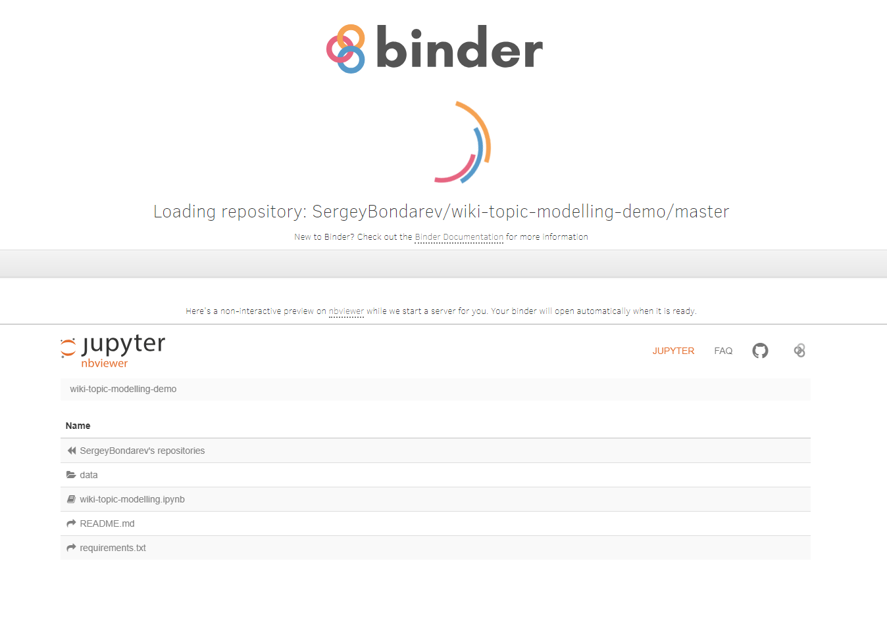
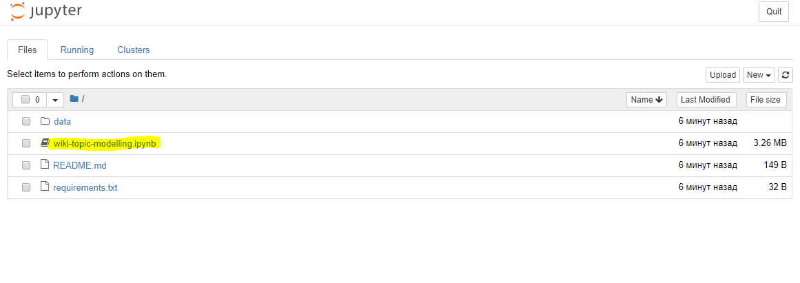
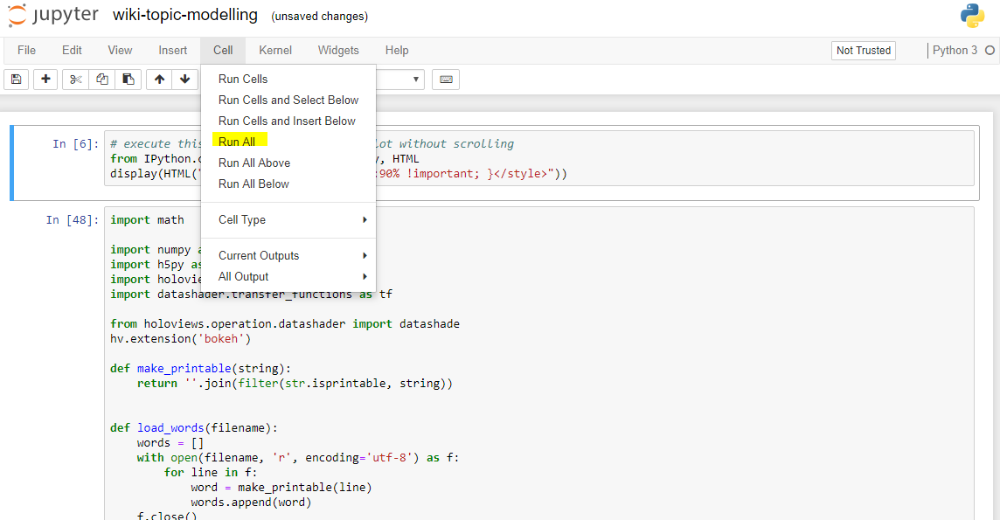
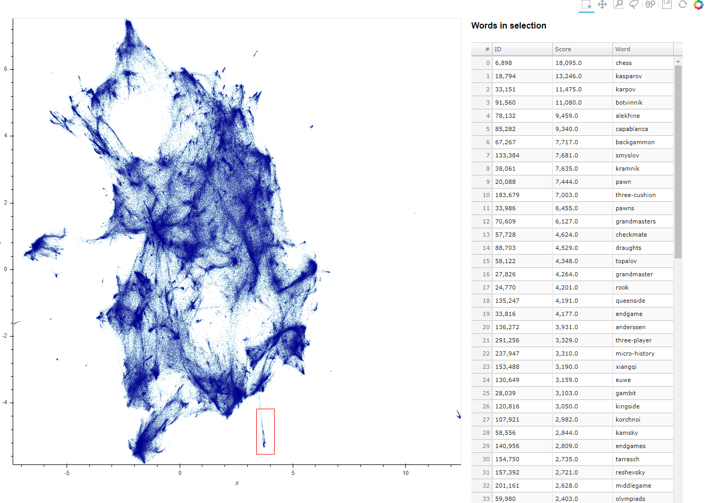

This is a demonstration of wiki-topic-modelling.

See also demo at Binder: https://mybinder.org/v2/gh/SergeyBondarev/wiki-topic-modelling-demo/master

**Instruction on how to proceed**:

1. Go to the https://mybinder.org/v2/gh/SergeyBondarev/wiki-topic-modelling-demo/master

2. Wait a while until the page is loaded. Server initialization can take up to 5 minutes, so be patient :)  

3. When server is ready click on *wiki-topic-modelling.ipynb*. A notebook will open in the new tab.   

4. Then run a notebook executing *Cell -> Run All* 

5. Finally have some exploring the data! 